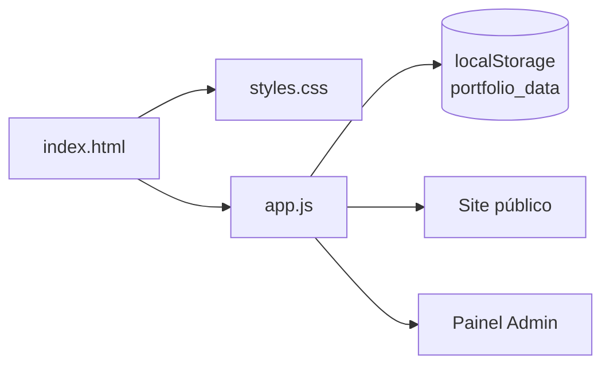

<div align="center">

<pre>
╔═══════════════════════════════════════════════════════════╗
║                                                           ║
║   ✦  P O R T F Ó L I O   S T A T I C   P R O T O T I P E  ✦
║                                                           ║
║         Uma landing elegante + mini painel admin          ║
║                                                           ║
╚═══════════════════════════════════════════════════════════╝
</pre>

[](https://developer.mozilla.org/pt-BR/docs/Learn/HTML)
[](./)
[](./)

<br />

**Protótipo front-end** — tema escuro, tipografia *Playfair + DM Sans*, animações suaves e conteúdo editável no navegador.

<br />

[🚀 Como rodar](#-como-rodar) · [📁 Estrutura](#-estrutura-do-projeto) · [✨ Funcionalidades](#-funcionalidades) · [🔐 Admin](#-painel-admin-protótipo) · [🎨 Personalizar](#-personalizar)

</div>

---

## 🌟 Visão geral

Este repositório é um **protótipo de portfólio pessoal** pensado para demonstrar layout, fluxo de navegação e uma camada simples de “CMS no browser”: dados de perfil, projetos, serviços, depoimentos e mensagens ficam no **`localStorage`** — sem backend, sem build, sem dependências npm.

> 💡 Ideal para **mockups**, **apresentações** ou como base para migrar depois para um framework ou API real.

---

## 🧭 Sumário interativo

Clique nos títulos abaixo para expandir cada bloco.

<details>
<summary><strong>📦 O que vem no pacote</strong></summary>

| Camada | Arquivo | Papel |
|--------|---------|--------|
| Página | `index.html` | Estrutura, seções e markup do site + admin |
| Estilo | `styles.css` | Tema, responsivo, modais, painel admin |
| Lógica | `app.js` | Renderização, filtros, `localStorage`, CRUD no admin |

</details>

<details>
<summary><strong>🛠️ Stack técnica</strong></summary>

- **HTML5** semântico  
- **CSS3** (variáveis, grid, animações, media queries)  
- **JavaScript** vanilla (ES6+)  
- **Font Awesome** + **Google Fonts** via CDN  

</details>

<details>
<summary><strong>⚠️ Limitações do protótipo</strong></summary>

- Login admin é **fixo no código** (não use em produção).  
- Dados vivem só no **navegador** — limpar cache / outro dispositivo = outro “banco”.  
- Formulário de contato **não envia e-mail**; apenas registra no painel localmente.  

</details>

---

## 🚀 Como rodar

1. **Clone ou baixe** esta pasta.
2. Abra o arquivo **`index.html`** no navegador (duplo clique ou *Open with Live Server*).
3. Pronto — não precisa instalar nada.

<details>
<summary><strong>💻 Opcional: servidor local rápido</strong></summary>

Se quiser evitar restrições de alguns navegadores com `file://`:

```bash
# Python 3
python -m http.server 8080

# Node (se tiver npx)
npx serve .
```

Depois acesse `http://localhost:8080` e entre em **`index.html`** (ou a raiz, se o servidor listar o index automaticamente).

</details>

---

## 📁 Estrutura do projeto

```
Portfólio Estatico/
├── index.html      ← entrada do site
├── styles.css      ← aparência completa
├── app.js          ← comportamento + persistência
└── README.md       ← você está aqui ✨
```

---

## ✨ Funcionalidades

| Área | O que faz |
|------|-----------|
| **Hero** | Texto dinâmico estilo *typewriter* a partir do perfil |
| **Sobre** | Bio, skills e anos de experiência configuráveis |
| **Projetos** | Grid com filtro por categoria + modal de detalhes |
| **Serviços** | Cards com ícones Font Awesome |
| **Depoimentos** | Carrossel simples com navegação por dots |
| **Contato** | Formulário que grava mensagens no admin |
| **Scroll** | Animação de entrada (*reveal*) nas seções |
| **Responsivo** | Menu mobile, grids adaptáveis |

---

## 🔐 Painel admin (protótipo)

No site, use o botão **Admin** na navegação.

<details>
<summary><strong>🔑 Credenciais de demonstração</strong></summary>

```
Usuário: admin
Senha:   admin123
```

> ⚠️ Troque ou remova isso antes de qualquer deploy público sério.

</details>

No painel você pode gerenciar:

- Dashboard com contadores e últimas mensagens  
- Perfil, skills, redes e CV (URL)  
- Projetos, serviços, depoimentos  
- Dados de contato exibidos na página  
- Lista de mensagens “recebidas” pelo formulário  

Tudo é salvo na chave **`portfolio_data`** do `localStorage`.

---

## 🎨 Personalizar

<details>
<summary><strong>Cores e tipografia</strong></summary>

Edite as variáveis no topo de `styles.css`:

```css
:root {
  --bg: #0a0a0a;
  --accent: #c9a84c;
  /* ... */
}
```

Fontes são carregadas no `<head>` de `index.html`.

</details>

<details>
<summary><strong>Conteúdo inicial (sem abrir o admin)</strong></summary>

O objeto **`DEFAULT_DATA`** em `app.js` define o estado inicial quando não há nada salvo no navegador.

</details>

<details>
<summary><strong>Zerar dados salvos</strong></summary>

No DevTools → **Application** → **Local Storage** → remova a entrada `portfolio_data` ou use “Clear site data”.

</details>

---

## 🔀 Fluxo simplificado



---

## 📝 Licença & uso

Projeto de **demonstração / protótipo**. Adapte textos, imagens, credenciais e fluxo de deploy conforme sua necessidade.

---

<div align="center">

**Feito com** ☕ **e front estático**

<br />

<sub>✦ Se este README te ajudou, deixe uma ⭐ no repositório quando publicar ✦</sub>

</div>
